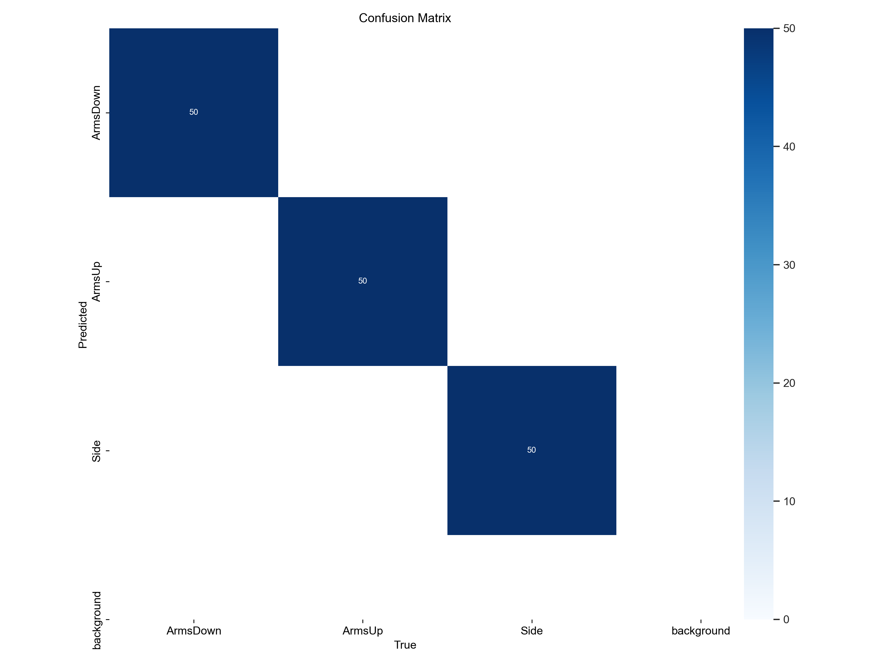

# Image sorting using Yolov8 Classifier

## Overview
This project is an image classifier using Yolo-v8. In this project we will utilize the Ultralytics YOLO model to process and classify images into different categories (e.g., 'armsUp', 'armsDown', 'Side'). The processed images are then organized and saved in the specified output folders. The script also calculates accuracy based on the provided labels

## Table of content
- [Requirements](#requirements)
- [Getting to know the dataset](#getting-to-know-the-dataset)
- [YOLO Image Processing Script](#yolo-image-processing-script)
- [Post-training / review](#post-training--review)
  - [Model performance metrics](#model-performance-metrics)
- [Conclusion](#conclusion)
- [Post-training / test on the dataset](#post-training--test-on-the-dataset)
- [Results](#results)
  - [Plots](#plots)
- [Sorting and renaming the images](#sorting-and-renaming-the-images)
  - [Overview](#overview)
  - [Functions](#functions)


## Requirements
- Python 3.x
- Required Libraries:
  - pandas
  - re
  - os
  - shutil
  - pickle
  - Ultralytics
  - OpenCv

## Getting to know the dataset:
So in order to create a precise model with good performance, the training data is very important. My purpose in this project is to sort out the dataset for furthur analysis, so i needed to get to know the datasets and images more closely.
the first one is easy lets take a look of how many images we have: 

From this easy plot we can tell that Aarhus hospital has most of the images, and because we dont wanna go through all the 35000 images, so it might be an advantege to use the images from this center to train the model. 

And after manually checking out the images from each center i chose to visualise the naming structures for the best dataset in terms of images quality, as naming of the images is also important to us in the long run, lets take a look of how the structures of the image naming for each center: 

In the plot above we can see that Aalborg dataset has the most accurate naming structure, it is also important that the images quality and lightning are the also the best in Aalborg dataset.

## YOLO Image Processing Script
First step is to create a custom trained Yolo classifier model and then run the script to sort out the images in folders like:

```
|-- Aalborg/
|   |-- ArmsDown
|       |-- image 1.jpg
|       |-- image 2.jpg  
|   |-- ArmsUp
|       |-- image 1.jpg 
|       |-- image 2.jpg 
|   |-- Side
|       |-- image 1.jpg 
|       |-- image 2.jpg 
```

To train the YOLO model, we need to follow Ultralytics instructions in training a classifier. Therefore the following heiarchy is recommended:

```
|-- dataset/
|   |-- train
|       |-- ArmsDown
|       |-- ArmsUp
|       |-- Side  
|   |-- test
|       |-- ArmsDown
|       |-- ArmsUp
|       |-- Side
|   |-- val
|       |-- ArmsDown
|       |-- ArmsUp
|       |-- Side 
```
>NOTE: these are all folders that needs to contain images, i went with 150 images for each folder, the results were good, still more images, can mean better performance.  

Now head to ```Classifier/model_training.py``` and run the script. It is going to take some time, so coffe break is recommended.
```python
from ultralytics import YOLO

def train_yolo():
    model = YOLO('yolov8x-cls.pt')
    results = model.train(data='E:/Jasper/DBCGRT/MHA/Classifier/dataset', epochs=100, imgsz=640, device=1)

if __name__ == '__main__':
    train_yolo()
``` 
Research for the desired hyperparameter in [**Ultralytics**](https://docs.ultralytics.com/modes/train/#resuming-interrupted-trainings:~:text=a%20training%20run.-,Arguments,-Training%20settings%20for) guide


## Post-training / review 
Lets examin the results of training our model, In the folder ```runs/classify/train```. 
The ```/weights``` folder contains the the custom trained models. 


##### Model performance metrics


1. Loss and Accuracy Metrics:

    The training loss decreases gradually over epochs, indicating that the model is learning from the training data.
    Metrics like accuracy_top1 and accuracy_top5 are consistently high (close to 1), suggesting good performance on the training set.

2. Validation Metrics:

    The validation loss also decreases initially but starts to stabilize around epoch 20, indicating a potential convergence of the model.
    Validation metrics, such as accuracy, remain high, indicating that the model generalizes well to unseen data.
3. Learning Rate:

    The learning rate (lr) decreases over epochs, which is a common strategy to fine-tune the model gradually.
4. Training Stability:

    The model seems to be stable during training, as there are no drastic fluctuations in the metrics.
5. Considerations:

    It's essential to monitor the validation metrics to ensure the model is not overfitting the training data.
    Further analysis, such as examining the precision-recall curves or exploring class-specific metrics, can provide additional insights into the model's performance.

##### Confusion matrix



We can always do a small test using ```model_test.py``` where the results of the classification be saved in ```/classifier/runs/classify/predict```
This script utilizes the Ultralytics YOLO model to make predictions on images within a specified folder. It finds image files with specific extensions in the given folder and its subfolders, then makes predictions using the YOLO model on each image, printing the class probabilities for each prediction. Additionally, there is a commented-out function (plot_boxes) intended to plot bounding boxes, confidences, and class IDs, which can be uncommented for visualization.

### Conclusion
The results of training the model were satisfying, the confusion matrix iondicated the ability of the model to differeniate between the classes and performance metrics shoes a good result. So it is time to move to the next part to run a sorting algortihm using the yolo model.


## Post-training / test on the dataset 
Lets head to the folder ```Classifier/data_run``` where i made the following scripts : 
```
data_run_aal.py #sort Out Aalborg
data_run_aar.py #sort Out Aarhus
data_run_Dres.py #sort Out Dresden
data_run_Ode.py #sort Out Odense
data_run_vej.py #sort Out Vejle
run_script.batch # automatically run all the scripts.
```
in those scripts some functions were implemented: 

- **prediction()**: Performs prediction using the YOLO model on the given image.
- **update_counters()**: Updates counters based on the predicted label and image name.
- **process_image()**: Processes an image, predicts its label, and saves it to the corresponding folder.
- **process_image_in_folders()**: Processes images in a folder and its subfolders.

### Results 
After running our algorithm, we can now see the results in **Processed_images** folder. 


It also work on the last 2 folders, i checked. 

### Plots
In this section we are going to visualise the important results of our classification model. lets take a look :


we can see the results my model has accomplished in terms of sepreating the patients images according to their posture, we can see that aarhus dataset has a bigger margin for error, but lets not forget that Aarhus dataset is the largest and most diverse betwen the rest of the datasets. So in general, i think of these as good results for the model.

# Sorting and renaming the images 

### Overview
in this part we are going to sort out the images that we have in our dataset, the purpose of this sorting algorithm, is to sort out the images based on the patients position and then rename the images according to the patients randomization number adn the year the image has been taken. So from this form : ```HYPO_802015_170921_b.jpg --->  802015 year 0.jpg ```
the image date is either based on the informations in the dataframe df.csv or based on the naming of the images, because some centers have defined the year of the image in the naming. check the implementations of the functions below.
Any way, lets head to the folder ```/Classifier/Sorting``` where i wrote a python module ```Image_extraction.py``` to process the images in the dataset. lets break down its fucnctions

## Functions
>```load_image_info(file_path, hospital_structure)```

Load file name, randomization number, and image year from a CSV or Excel file with explicit labels.

>```extract_info_from_filename(file, hospital_structure)```

Extract randomization number and date information from the image filename based on the hospital structure.

>```sort_and_rename_images(input_dir, output_dir, info_file, hospital_structure)```

Sort and rename images in the specified directory based on information from the text file for a given hospital structure.

>```save_to_excel(processed_images, outputfile)```

Save processed image information to an Excel file.


Update the ```input_dir, output_dir, info_file, and hospital_structure``` variables in the sort_and_rename_images function.

**Modify the script as needed for your specific use case:**

Using the model is now easy, i created 2 scripts inside the Sorting folder, **export.py** and **export.ipynb**. those two scripts are optiontional in how we wanna approach this, the export.py script is mainly handling the hospitals dataset one by one, just by changing the ```input_dir,  output_dir, hospital_structure and info_file``` paths. This will make it easier to debugg, and examine outlires and change the code accordingly.

Now we need to observe the results exported on the other side, i suggest that we go through single hospital dataset, to understand the method needed for renaming in image_extraction.py.
there will be outliers that doesnt fit the structure, and should be done manually, all outliers should be located in the Other folder inside each hospital dataset.

### Plots 

The following plots shows a snippet of the results of the sorting algorithm, and the images renamed.


And the next plots are for the image count for the following hospitals. 


We can see ther results for our sorting and renaming algorithm, Aalborg dataset is the best in naming structures, thus the zero erros in renaming, some images other hospitals like Aarhus, Odense and Dresden need to be checked manually adn renamed either before or after the running the script.