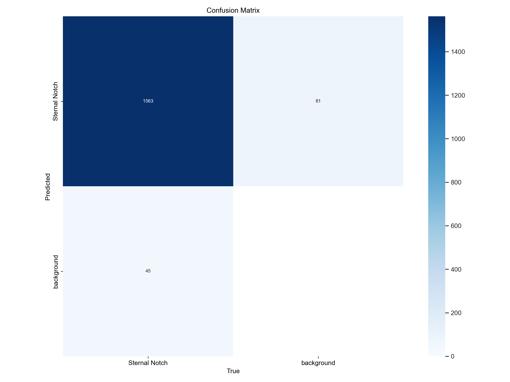
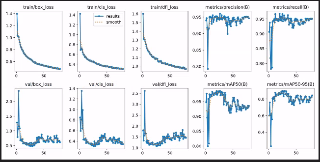
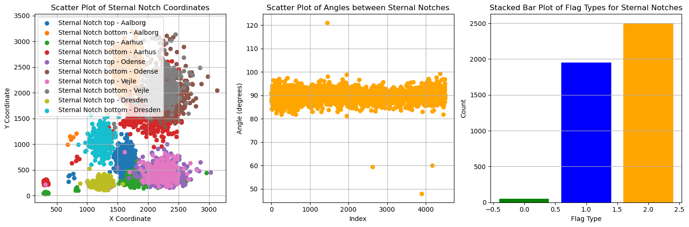
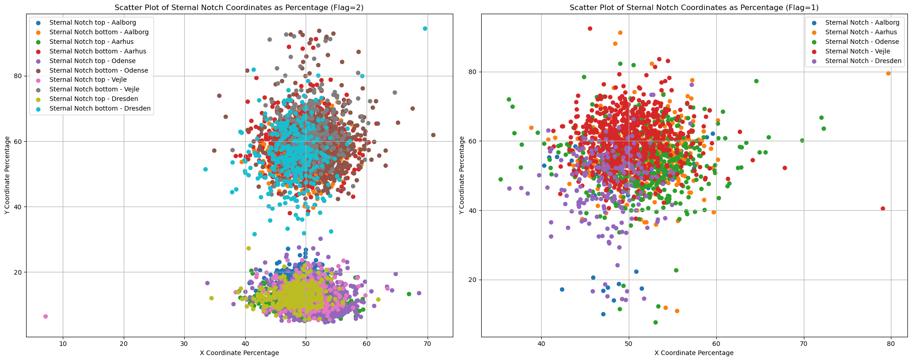
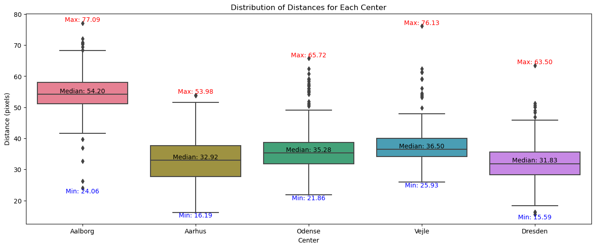

# Sternal Notch Marker Project

## Table of Contents
1. [Overview](#overview)
2. [Requirements](#requirements)
3. [Extracting Sternal Notches](#extracting-sternal-notches)
    1. [Label_extraction.py Overview](#label_extractionpy-overview)
4. [Training the YOLO Model](#training-the-yolo-model)
    1. [Post Training / Review](#post-training--review)
    2. [Post Training / Test on New Data](#post-training--test-on-new-data)
5. [Results](#results)
    1. [Confusion Matrix](#confusion-matrix)
    2. [Training Batch](#training-batch)
    3. [Post-Training / Review](#post-training--review)
    4. [Post-Training / Test on New Data](#post-training--test-on-new-data)
6. [Conclusion](#conclusion)

## Overview

This project focuses on extracting sternal notches from an existing dataframe, drawing bounding boxes around them, and training a YOLOv8 model for future predictions.

## Requirements

Ensure you have the following Python libraries installed:
- `Ultralytics`
- `cv2`
- `pandas`
- `numpy`
- `matplotlib`
- `tqdm`

## Extracting Sternal Notches
Before getting into the code parts we need to understand what do we need to do. 
1) We have a dataframe that already contains sternal notches point in it, in our case is the armsDown dataframe in the following path "E:/Jasper/BCCTCore2.0/df.csv"
2) We can use the test.py to visualize the images with the sternal points from the dataframe. check the dataframe path before running the code. 
3) We will extract the notches using a simple algorithm, which is based on the fact that there are two points in each image
4) We need to prepare the extracted data for the YOLO model. (train/validation)


## Label_extraction.py overview 
This script is used to extract labels (sternal notches) from the image and save them in a csv file. the following functions were implemented: 

```python
# Calculates bounding box coordinates as percentages of image dimensions.
def calculate_bounding_box(center_x, center_y, box_width,
                             box_height, img_width, img_height)

# optional function to visualize the sternal notches while processing the dataframe.
def plot_bounding_boxes(image, sternal_purple_x, sternal_purple_y,
                         sternal_green_x, sternal_green_y, bbox_width, bbox_height)

#Processes an image, retrieves sternal notch positions, calculates bounding box coordinates, and saves the results.
def process_image(index, dataframe: pd.DataFrame, save_dir)
```

then we have the main Execution where the script reads the CSV file into a Pandas dataframe, creates 'train' and 'val' subdirectories, and processes images. It randomly assigns images to the training or validation set and handles errors during image processing.


```python
if __name__ == "__main__":
    
    counts = 0
    dataframe = pd.read_csv(Path("E:/Jasper/BCCTCore2.0/df.csv"), index_col=0)
    save_dir = "C:/Users/student/Desktop/images/scale_marker/dataset"

    train_dir = os.path.join(save_dir, 'train')
    val_dir = os.path.join(save_dir, 'val')
    
    #create the train/val folder if not existed
    os.makedirs(train_dir,exist_ok=True)
    os.makedirs(val_dir, exist_ok=True)
    
    # loop through the dataframe 
    for index in tqdm(range(len(dataframe))):
        #split the data 90% -10% 
        is_train = np.random.rand() < 0.9
        img_save_dir = train_dir if is_train else val_dir
        try: 
            process_image(index,dataframe,img_save_dir)
        except Exception as e: 
            print(f" Error processing image at index {index}: {e} ")
            counts +=1

    print(f"Done with {counts} errors.")
```
the results are saved in the folder save_dir 
```
MHA_praktik/
|-- scale_marker/
|   |-- label_extract.py.py
|   |-- dataset/
|       |-- train/
|           |-- images/
|           |-- labels/
|       |-- val/
|           |-- images/
|           |-- labels/
```
After verifying the script has run successfully and the data split in the desired folder we need to move to the next part, which is training the YOLO model on the dataset we created.

## Training the YOLO model
Now we need to check few things before we run the script. First lets make sure we are in the correct folder.
```
MHA_praktik/
|-- scale_model/
|   |-- yolov8x.pt
|   |-- model_training.py
|   |-- custom_data.yaml
|   |-- runs

```
Make sure you have the right paths in custom_data.yaml 
```Yaml
path:  C:/Users/student/Desktop/images/scale_marker/dataset
train: C:/Users/student/Desktop/images/scale_marker/dataset/train
val: C:/Users/student/Desktop/images/scale_marker/dataset/val
```
Next the model_training.py is where we train the our model on our custom data : 
```python
def train_yolo():
    model = YOLO('yolov8x.pt')
    results = model.train(data='custom_data.yaml', epochs=200, imgsz=640, device=1)
```
>The training takes a while so be patient and let it finish. The weights will be saved in the scale_model folder under 'runs/detect/train/weights'

you can either run the mode_training using 

``` 
python model_training.py
```
Or using the enviroment
``` 
conda python model_training.py
```
### Post training / review
Lets take a look on what my training has created.

The confusion matrix provides a visual representation of how well a machine learning model is performing. It shows the number of True Positives (correctly predicted positive samples), True Negatives (correctly predicted negative samples), False Positives (incorrectly predicted positive samples), and False Negatives (incorrectly predicted negative samples). It's a valuable tool for assessing the performance of a classification model.



$Training/box_loss:$ The loss associated with bounding box predictions. It measures the difference between the predicted bounding box and the ground truth.
$Train/cls_loss:$ The classification loss. It measures the difference between predicted class probabilities and the actual class labels.
$Train/dfl_loss:$ The loss related to facial landmark predictions. It assesses the accuracy of predicted facial landmarks compared to the true landmarks. Lower values indicate better model performance.
and other metrics for the model.




### Post-training / Test on new data
After trainnig the yolo model, we need to test it on new data.

So lets head to the folder ```/scale_marker ```. Here we will work with the ```extract_notches.py``` to leverage a pre-trained YOLO model to detect sternal notches in a set of images. It calculates angles between sternal notches and filters results based on specified criteria. The processed data is stored in a Pandas DataFrame and saved to a CSV file.

### Functions

```python
predict_on_image(image_path, model, threshold=0.3)
#Makes predictions on a given image using the YOLO model.

calculate_angle(sternal_notch_x1, sternal_notch_y1, scale_x, scale_y)
#Calculates the angle between two points.

process_sternal_notches(boxes, scores, image_width, image_height)
#Process sternal notches to find the best pair and calculate the angle.

```
### Inside the Main execution : 

This script processes a set of image folders using a pre-trained YOLO model to detect sternal notches.
    It calculates angles between sternal notches and filters the results based on specified criteria.
    The processed data is then stored in a Pandas DataFrame and saved to a CSV file.

    Steps:
    1. Load the YOLO model from the specified path.
    2. Define the top-level folders containing images to be processed.
    3. Initialize an empty Pandas DataFrame to store the results.
    4. Iterate through each specified top-level folder and its subfolders.
    5. For each image file in the folders, use the predict_on_image function to get bounding boxes and scores.
    6. Process the sternal notches using the process_sternal_notches function.
    7. Append the results to the Pandas DataFrame.
    8. Count occurrences of each flag category indicating the number of sternal notches detected.
    9. Display the flag counts.
    10. Save the processed data in the DataFrame to a CSV file.


### Results
1) Flag 0: No sternal notch detected.
2) Flag 1: One sternal notch detected.
3) Flag 2: Two detections with the correct order.
4) Flag 3: Corrected two detections based on the closest angle to 90 degrees.


### Output
The processed data is saved in 'angle_based_df.csv'.
```
Flag Counts:
Flag 0 count: 49
Flag 1 count: 1952
Flag 2 count: 2503
Flag 3 count: 0
```
we can always test the results in the new dataframe using ```test.py``` where we plot the extracted sternal notches, remember to check the dataframe paths. 


### Plots
Finally lets plot the results of our work
#### General plots showing the sternal notches, angle, and flags
The yolo model generally performed well, as showed before in the flags, there are now about 60 % of the cases presented, the precentage is decent considering the quality and positioning of the top sternal notch is totally unexpected, sometime were cut out of the image, sometimes it dives into the collar bone, so all considered, 60 procent is very good result. 



#### The sternal notches in each hospital in procentage of the image dimensions
In the following plot we can see the coordinates of pairs of sternal notches for each center, this way can help us identifying the position of the sternal notch according to the image dimensions. To the left is where i found 2 sternal notches and the left is for the signle sternal notches i found. 



#### The distance measurement in procent
The box plot below shows the distances between the sternal notches in procentage to the image dimensions



We can learn from these plots about the variations present in the dataset. By observing the spread of distance measurements we gain a better understandment of how the sternal notches are distributed across different images.


# Conclusion 
In conclusion we have successfully extracted the sternal notches from CT scans and classified them into different categories based on their angles and positions. We calculated the distance and the angle between the sternal notches, we also applied nms function to prevent double detection and overlapping points. the measurments and plots provides us awith a good insight to our analysis and can all be found in the rapport folder, see if you can use them. 

